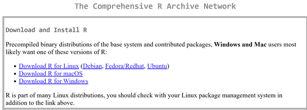
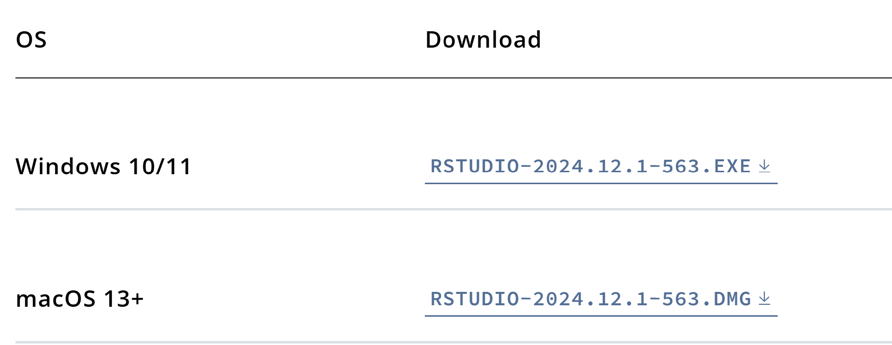

Both R and RStudio are free and easy to download. Many free, online resources explain these steps in more detail, but here are the basics.  
  
# Install R First

The first step is to install R. You can download and install R from the [Comprehensive R Archive Network](https://cran.r-project.org/) (CRAN).  

```{r download-r-img, echo=FALSE,  out.width = '50%'}

```

**Windows:**

- Click [Download R for Windows](https://cran.r-project.org/bin/windows/) option.
- Select [base](https://cran.r-project.org/bin/windows/base/), since this is our first installation of R on our computer.  
- Click on the link for downloading the latest version of R (an .exe file).  
- When the download completes, double-click on the .exe file and follow the standard instructions. If asked to select Customize Startup or Accept Default Startup Options, **choose the default options**.   
  
  
**Mac:**

- Click [Download R for MacOS X](https://cran.r-project.org/bin/macosx/).  
- Look for the most up-to-date version of R (new versions are released frequently and appear toward the top of the page) and click the .pkg file to download.    
- When the download completes, double-click the .pkg file and follow the standard instructions.  
- Drag and drop the R application into the Applications folder.

# Install RStudio
  
Now that R is installed, you can install [Rstudio](https://posit.co/download/rstudio-desktop/)  

```{r download-rstudio-img, echo=FALSE,  out.width = '50%'}

```
  
- Click "DOWNLOAD RSTUDIO DESKTOP FOR WINDOWS" or scroll down to "All Installers and Tarballs" to find your appropriate installation file for your system.   
- Run the installation file.  
  

# Create an R Script File 

Now that you've install the software, go ahead and open RStudio. Click the green + button in the top left corner and select "R Script" or click File, go to "New File", and select "R Script". 

# Install Packages

We need to use various "packages" to perform different functions in R. When its your first time using R, you'll need to install any packages you'll want to use before you can "load" (i.e., use) them.  

> In the console (or in your r script file if you want to save the code for later), use: 
> 
>- `install.packages("[packagename]", dependencies = TRUE)` for installing one package  
>- `install.packages(c("[packagename1]","[packagename2]","[packagename3]",..., dependencies = TRUE)` for installing multiple packages at once.  
> 
> After its installed, you can "load" your package using:
> 
>- `library([packagename])`  
>
> You will only need to install each package once, but will need to load each package every session.   
  
I've included code below that creates a function you can use that will loop through each package to check if it's installed, install it if it is not, and then load it.   
Keep in mind that R is ***case-sensitive***, so make sure the package names are exact.  


```{r eval=FALSE}
# List of packages
packageList <- c("tidyverse", "janitor", "dplyr", "ggplot2")

# Loop through the list and check if each package is installed
for (pkg in packageList) {
  if (!require(pkg, character.only = TRUE)) {
    cat("Installing package:", pkg, "\n")
    install.packages(pkg, dependencies = TRUE)
    library(pkg, character.only = TRUE)
  } else {
    cat("Package already installed:", pkg, "\n")
    library(pkg, character.only = TRUE)
  }
}
```

You can also install rmarkdown if you want to create dynamic documents/reports that combine code, text, and rendered output in R.  

```{r eval=FALSE}
install.packages("rmarkdown", dependencies = TRUE)
```

If you want to generate PDF output from rmarkdown, you will also need to install LaTeX.  

```{r eval=FALSE}
install.packages('tinytex')
tinytex::install_tinytex() 
```